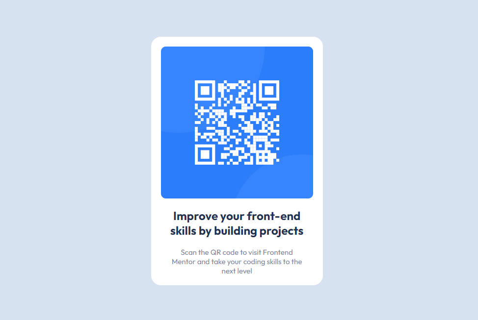

# Frontend Mentor - QR code component solution

This is a solution to the [QR code component challenge on Frontend Mentor](https://www.frontendmentor.io/challenges/qr-code-component-iux_sIO_H). Frontend Mentor challenges help you improve your coding skills by building realistic projects.

## Table of contents

- [Overview](#overview)
  - [Screenshot](#screenshot)
  - [Links](#links)
- [My process](#my-process)
  - [Built with](#built-with)
  - [What I learned](#what-i-learned)
- [Author](#author)

## Overview

This challenge is about creating a responsive QR-code card. It contains 3 main elements: a picture of qr code, a card title, a card description. It will be placed at the center of the page (in this challenge only).

### Screenshot



### Links

- Solution URL: [https://fmc-qrcode.vercel.app/](https://fmc-qrcode.vercel.app/)
- Live Site URL: [https://fmc-qrcode.vercel.app/](https://fmc-qrcode.vercel.app/)

## My process

1. Download the starter-kit for this challenge.
2. Then read the README to understand how the folder structure
3. Start to code
4. Push to a github repository
5. Publish to vercel
6. Submit the solution

### Built with

- Semantic HTML5 markup
- CSS custom properties
- Flexbox

### What I learned

I learned some CSS Flexbox techniques, such as

- How to make the box align center (both horizontal and vertical) in the page.

```css
.container {
  display: flex;
  flex-direction: column;
  align-items: center;
  justify-content: center;
  width: 100%;
  height: 100%;
}
```

- How to sizing the image to fit it inside the box (the box has dynamic width based on the browser's width)

```css
.card-image img {
  border-radius: 10px;
  overflow: hidden;
  width: 100%;
  height: 100%;
  object-fit: contain;
}
```

- How to add a gap between flex items:

```css
.card-body {
  display: flex;
  flex-direction: column;
  gap: 20px; /* this will add a gap of 20px between flex items inside .card-body */
  text-align: center;
}
```

### Continued development

Use this section to outline areas that you want to continue focusing on in future projects. These could be concepts you're still not completely comfortable with or techniques you found useful that you want to refine and perfect.

## Author

- Website - [Github](https://github.com/vuxlee584)
- Frontend Mentor - [@quangvule](https://www.frontendmentor.io/profile/quangvule)
